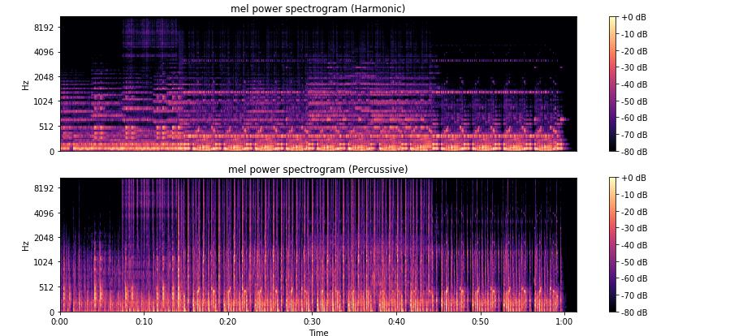

# Zalo AI Challenge - Music Genre Classification

This repository contains my source code for the Zalo Music Genre Classification challenge. This solution reached top 3 in the [Private Leaderboard](https://challenge.zalo.ai/portal/music/final-leaderboard) with a single model (not using model ensemble / stacking). 
For more info about this challenge visit [https://challenge.zalo.ai/portal/music/](https://challenge.zalo.ai/portal/music)

## Quick Start

1. Install required packages with `pip install -r requirements.txt`
2. Download Zalo Music Genre dataset [here](https://challenge.zalo.ai/portal/music/data) and place under the `data/` directory
3. Run `./preprocess.sh` to extract and generate spectrogram from the training data (_can be very time-intensive - depend on your CPU_)
4. Run `./train.sh` to train new model from scratch
or download the pre-trained model [here](https://drive.google.com/file/d/1PmDkxjoxI09XJT3J77x21ncKde8KNGZr/view?usp=sharing) (place under the `model/` directory)
6. Run `./predict.sh` to get prediction result with new data

## Data preprocessing

Before training the classification model, we have to tranform raw data from audio samples into more meaningful representations. [Librosa](https://github.com/librosa/librosa) has several methods for extracting various useful audio features: STFT (Short-Time Fourier Transform), Mel-spectrogram, MFCC (Mel-frequency cepstral coefficients), CQT (Constant-Q Transform), Harmonic-Percussive spectrogram, Chromagram, ... More detail about these features can be found in this [demo notebook](http://nbviewer.jupyter.org/github/bmcfee/librosa/blob/master/examples/LibROSA%20demo.ipynb) from `librosa` git repo. 

In this project, the `src/preprocess.py` script provided convenient wrapper functions to extract audio features using `librosa` and save them into grayscale image. These images can be stacked later in different combinations to find the best features to discriminate song's genres. Take a look at this file if you want to tweak which features to compute.

The pre-trained model provided in this repo was trained on Harmonic-Percussive spectrogram as the input features. The aim of the [Harmonic/Percussive separation](http://mir.ilsp.gr/harmonic_percussive_separation.html) is to decompose the original music signal to the harmonic (i.e. pitched instruments) and the percussive (non pitched instruments, percussion) parts of the signal. These decomposed components could enclose important information about the music genre.    

## Model

Model architectures are defined in `src/model.py`. This script provided helper functions to build different types of DL model: ResNet with varied depths (ResNet18, RestNet34, etc.), CRNN (CNN - LSTM hybrid) and a simple CNN. You can experiment with these models to select the best one for your task. The pre-trained model is a ResNet18 variant with input shape of (128, 1024, 2) _(height, width, channel)_

Input of the CNN models is a list of sliced spectrogram extracted from an audio sample. Final label for a song will be computed by weighted average the probability over each slice.

## Experiments

Below is what I found during my experiments:
 + ResNet18 was the most suitable architecture considering both performance (validation accuracy) and training time.
 + For imbalanced dataset, weighted loss and data upsampling play important role in getting better generalization.  
 + Weighted average over the sliced spectrograms also help improve prediction accuracy.

## Todo

Some interesting directions to experiment with... 

+ Ensemble different model types
+ Train models with fine-tuning
+ Better data sampling with augmentation

## Helpful Resources

Here are some resources I found helpful for this challenge:

* [https://musicinformationretrieval.com/](https://musicinformationretrieval.com/)
* [http://mir.ilsp.gr/harmonic_percussive_separation.html](http://mir.ilsp.gr/harmonic_percussive_separation.html)
* [http://nbviewer.jupyter.org/github/bmcfee/librosa/blob/master/examples/LibROSA%20demo.ipynb](http://nbviewer.jupyter.org/github/bmcfee/librosa/blob/master/examples/LibROSA%20demo.ipynb)
* [https://github.com/raghakot/keras-resnet](https://github.com/raghakot/keras-resnet)
